## Why Linux for Embedded Systems?
There are many reasons for the rapid growth of embedded
Linux. 
To name a few:
- Royalties: Unlike traditional proprietary operating systems, Linux can be deployed without any royalties.
- Hardware Support: Linux supports a vast variety of hardware devices including all major and commonly used CPU architectures: ARM, Intel x86, MIPS, and PowerPC in their respective 32-bit and 64-bit variants.
- Networking: Linux supports a large variety of networking protocols. Besides the ubiquitous TCP/IP, virtually any other protocol on any physical medium is implemented.
- Modularity: A Linux OS stack is composed of many different software packages. Engineers can customize the stack to make it exactly fit their application.
- Scalability: Linux scales from systems with only one CPU and limited resources to systems featuring multiple CPUs with many cores, large memory footprints, several networking interfaces, and much more.
- Source Code: The source code for the Linux kernel, as well as for all software packages comprising a Linux OS stack, is openly available.
- Developer Support: Because of its openness, Linux has attracted a huge number of active developers, and those developers have quickly built support for new hardware.
- Commercial Support: An increasing number of hardware and software vendors, including all semiconductor manufacturers as well as many independent software vendors (ISV), are now offering support for Linux through products and services.
- Tooling: Linux provides myriad tools for software development ranging from compilers for virtually any programming language to a steadily growing number of profiling and performance measurement tools important for embedded systems development.

and the important thing is that in our graduation project we didn't need to develop the device drivers for UART ,camera and many others and this decreased our development time

## Embedded Versions of Full Linux Distributions
- Debian (www.emdebian.org)
- Fedora (https://fedoraproject.org/wiki/Embedded)Gentoo (https://wiki.gentoo.org/wiki/Project:Embedded)
- SUSE (https://tr.opensuse.org/MicroSUSE)
- Ubuntu (https://wiki.ubuntu.com/EmbeddedUbuntu)

  **and we are working on Ubuntu**

## Embedded Linux Development Tools
- Baserock

    Baserock is an open source project that provides a build system for Linux distributions, a development environment, and a development workflow in one package.
    The project’s homepage is at http://wiki.baserock.org.

- Buildroot

    Buildroot is a build system for complete embedded Linux systems using GNU Make and a set of makefiles to create a cross-compilation toolchain, a root filesystem, a kernel image, and a bootloader image. The project’s homepage is at  http://buildroot.uclibc.org.
    Buildroot mainly targets small footprint embedded systems and supports various CPU architectures. To jump start development it limits the choice of configuration options and defaults to probably the most commonly used ones for embedded system.

- OpenEmbedded

    OpenEmbedded (www.openembedded.org) is a build framework composed of tools, configuration data, and recipes to create Linux distributions targeted for embedded devices. At the core of OpenEmbedded is the BitBake task executor that manages the build process.

- The Yocto Project

    **Yocto Project is our subject**. It is listed here to complete this overview of the embedded Linux landscape. 
    You can find its webpage at https://www.yoctoproject.org.

## we have to approaches for building our embedded project:
- top-down :

    In this approach, you start with one of the many
    available Linux distributions and customize it according to your requirements by adding and/or removing software packages.
    The author took this approach many years ago with a high-speed image processing system running on x86 server hardware. It is a viable approach and has its appeal because using a tested and maintained distribution alleviates some of the more tedious tasks of building and maintaining your own distribution. And you may be able to get support for it.
    However, it may limit you in your choice of hardware, since most off-the-shelf Linux distributions are built for x86 hardware. And, of course, picking the right distribution to start off with and rightsizing it for your target device is not that simple either.

- Bottom-up: 

    The bottom-up approach entails building your own custom Linux distribution from source code starting with a bootloader and the kernel and then adding software packages to support the applications for your target device. This approach gives you the most control, but it is also a challenging task. You will have to make many choices along the way, from selecting the right toolchain and setting kernel configuration options to choosing the right software packages. Some of these choices are interdependent, such as the choice of toolchain and target library, and taking the wrong turn can quickly send you
    down a dead end. After you have successfully built and deployed your own distribution, you are left with the burden of maintaining it—finding patches and security updates for the kernel and all the other packages you have integrated with your distribution.

    **This is where the strengths of the Yocto Project lie**. It combines the best of both worlds by providing you with a complete tool set and blueprints to create your own Linux distribution from scratch starting with source code downloads from the upstream projects. 
    The blueprints for various systems that ship with the Yocto Project tools let you build complete operating system stacks within a few hours. 
    You can choose from blueprints that build a target system image for a basic system with command-line login, a system with a graphical user interface for a mobile device, a system that is Linux Standard Base compliant, and many more.

    You can use these blueprints as a starting point for your own distribution and modify them by adding and/or removing software packages.

## Yocto Project
- The Yocto Project (YP) is an open source collaboration project containing a comprehensive suite of tools, templates, and resources that helps   
  developers create custom Linux-based systems regardless of the hardware architecture.

**It’s not an embedded Linux distribution, it creates a custom one for you.**

### Prerequisites

- how to prepare your computer to become a YoctoProject development host.

### Hardware Requirements
Despite their capability to build Linux OS stacks, the Yocto Project tools require a build host with an x86 architecture CPU.
Both 32-bit and 64-bit CPUs are supported. A system with a 64-bit CPU is preferred for throughput reasons. The Yocto Project’s build system makes use of parallel processing whenever possible. Therefore, a build host with multiple CPUs or a multicore CPU significantly reduces build time. Of course, CPU clock speed also has an impact on how quickly packages can be built.Memory is also an important factor. BitBake, the Yocto Project build engine, parses thousands of recipes and creates a cache with build dependencies. Furthermore, the compilers require memory for data structures and more. 
**The tools do not run on a system with less than 1 GB of RAM; 4 GB or more is recommended.**

Disk space is another consideration. A full build process, which creates an image with a graphical user interface (GUI) based on X11 currently consumes about 50 GB of disk space. If, in the future, you would like to build for more architectures and/or add more packages to your builds, you will require additional space.**It is recommended that the hard disk of your system has at least 100 GB of free space**. Since regular hard disks with large
capacity have become quite affordable,**we recommend that you get one with 500 GB or more to host all your Yocto Project build environments.**

Since build systems read a lot of data from the disk and write large amounts of build output data to it, disks with higher I/O throughput rates can also significantly accelerate the build process.
Using a solid-state disk can further improve your build experience, but these devices, in particular with larger capacity, are substantially higher in cost than regular disks with spinning platters. Whether you are using conventional hard drives orsolid-state disks, additional performance gains can be realized with a redundant array of independent disks (RAID) setup, such as RAID 0.

- **Internet Connection**

The OpenEmbedded build system that you obtain from the project’s website contains only the build system itself—BitBake and the metadata that guide it. It does not contain any source packages for the software it is going to build. These are automatically downloaded as needed while a build is running.
Therefore, you need a live connection to the Internet, preferably a high-speed connection.
Of course, the downloaded source packages are stored on your system and reused for future builds. You are also able to download all source packages upfront and build them later offline without a connection to the Internet.

### software requirement
1- you will need a recent Linux distribution:
- CentOS
- Fedora
- openSUSE
- **Ubuntu**

In general, both the 32-bit and the 64-bit variants have been verified; however, it is recommended that you use the 64-bit version if your hardware supports it.

2- install yocto project bitbake extension on vs code.

3-prepare the environment host machine by installing these additional software packages 

    sudo apt install gawk wget git diffstat unzip texinfo gcc build-essential chrpath socat cpio python3 python3-pip python3-pexpect xz-utils debianutils iputils-ping python3-git python3-jinja2 libegl1-mesa libsdl1.2-dev python3-subunit mesa-common-dev zstd liblz4-tool file locales libacl1
    sudo locale-gen en_US.UTF-8

4- Choose YOCTO release [- - wiki.yoctoproject.org/wiki/Releases](https://wiki.yoctoproject.org/wiki/Releases) 
    - [github.com/yoctoproject/poky](https://github.com/yoctoproject/poky) 

##### clone poky.

    git clone -b kirkstone https://github.com/yoctoproject/poky.git

##### switch directory.

    cd poky

5- Configuring the Build Environment

Poky provides the script oe-init-build-env to create a new build environment. The script sets up the build environment’s directory structure and initializes the core set of configuration files. It also sets a series of shell variables needed by the build system. You do not directly execute the oe-init-build-env script but use the source command to export the shell variable settings to the current shell

##### - source <script>
    source oe-init-build-env

Inside the newly created build environment, the script added the directory conf and placed the two configuration files in it:
bblayers.conf and local.conf .

##### - after sourcing ---> build directory.
    cd conf
    vi local.conf

In local.conf , various variables are set that influence how BitBake builds your custom Linux OS stack.
###### Linux OS stack

##### - change Machine Variable.
    MACHINE ??="qemuarm64"

##### - Add Number of threads:

    BB_NUMBER_THREADS="8"
    PARALLEL_MAKE="-j 8"

The default value for the two parallelism options BB_NUMBER_THREADS and PARALLEL_MAKE is automatically computed on the basis of the number of CPU cores in the system using all the available cores. You can set the values to less than the cores in your system to limit the load. Using a larger number
than the number of physical cores is possible but does not speed up the build process. BitBake and Make spawn more threads accordingly, but they run only if there are CPU cores available.
Never forget the quotes around the variable settings. Also note that for PARALLEL_MAKE , you have to include the -j , such as "-j 4" because this value is passed to the make command verbatim.

##### - build image.
    bitbake core-image-minimal # image name (* meta-data *).

 - You may also instruct BitBake to first download all the sources without building. You can do this with

 - you can instruct BitBake to continue building even if it encounters an error condition as long as there are tasks left that are not impeded by the error:
 
 The -k option tells BitBake to continue building until tasks that are not dependent on the error condition are addressed.
##### - after build
    runqemu <MACHINE> # runqemu qemuarm64 nographic

6- and finally add the path of this file to ~./bashrc

## Yocto Project Family
The Yocto Project is not just a single open source project but combines multiple projects under one umbrella.

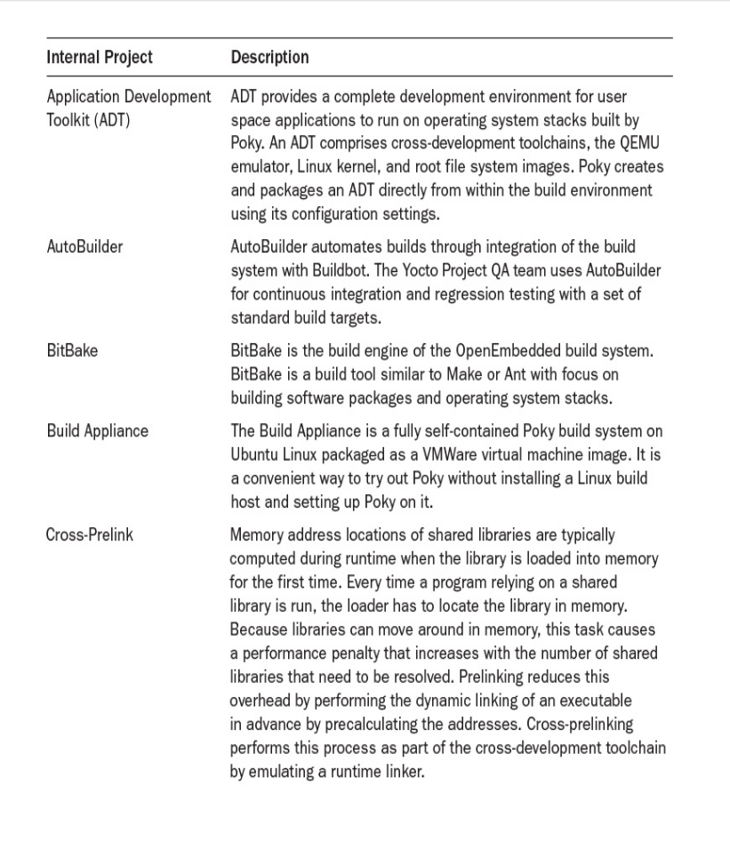
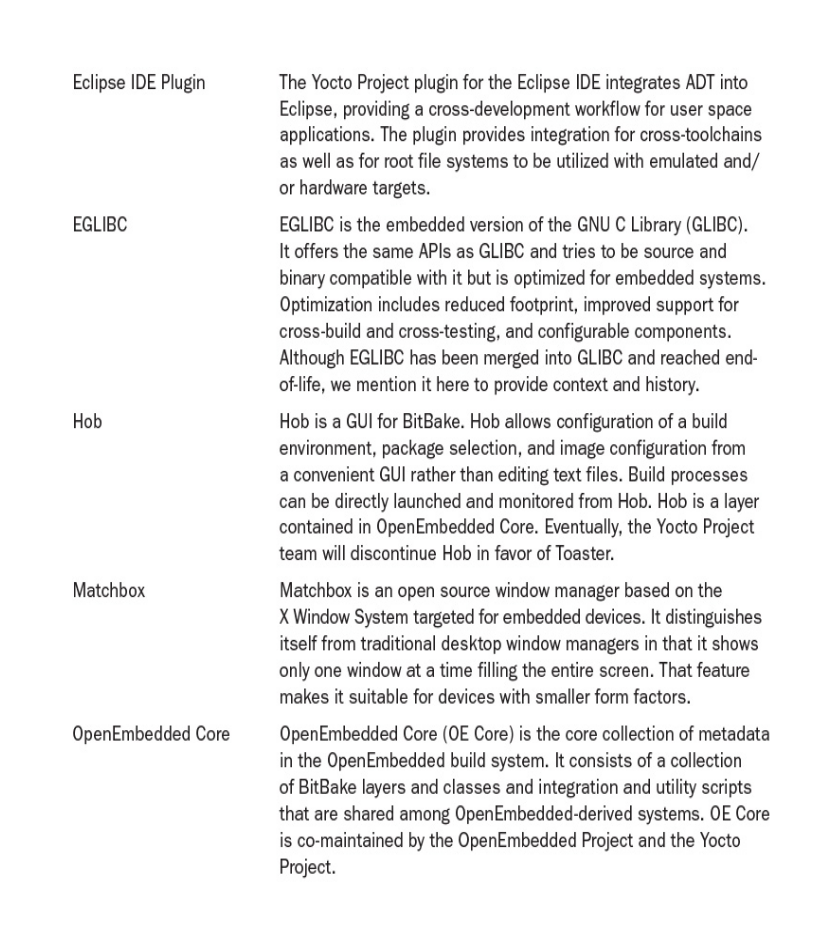
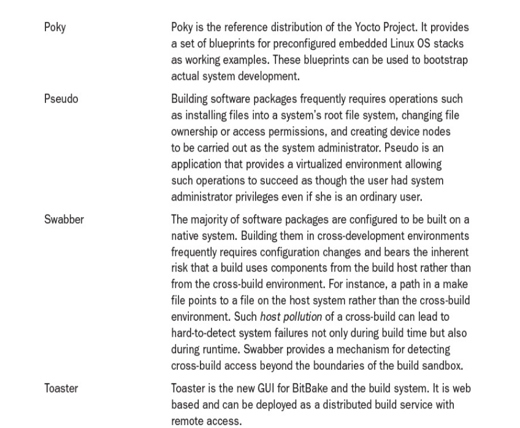

## Important Yocto Project Terms

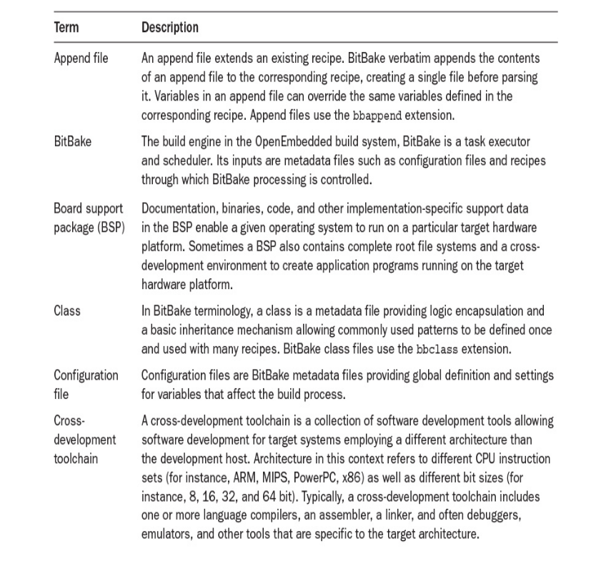
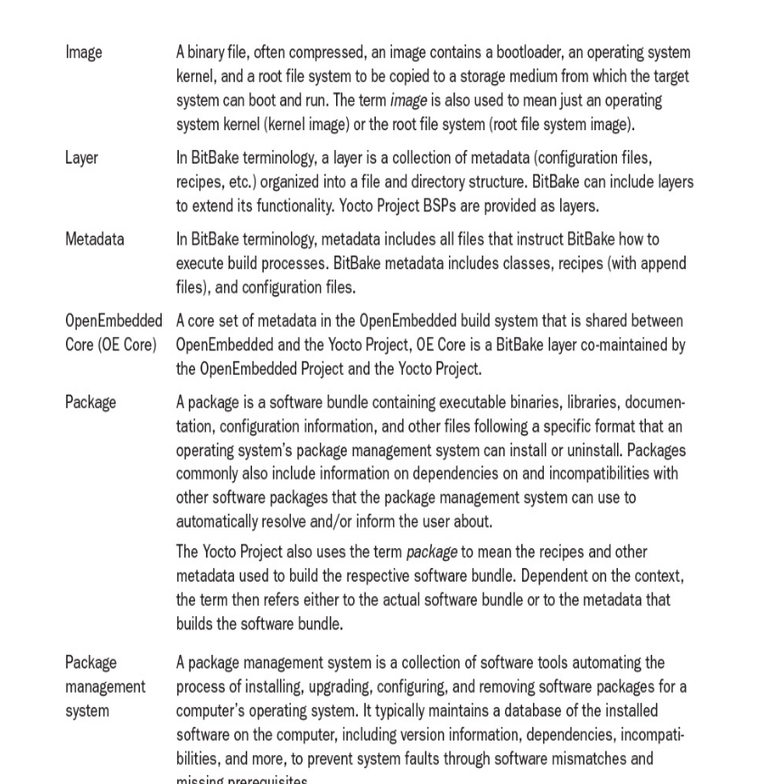
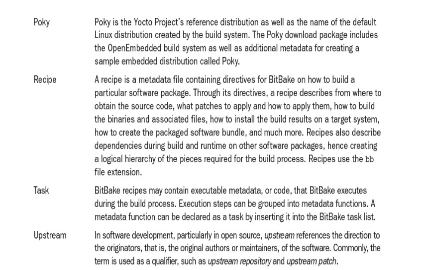

## what is the difference between OpenEmbedded project , Yocto project , OpenEmbedded-Core

### openembedded project
- The original community project to build embedded Linux distributions with recipes and a build engine (BitBake).
- Started before the Yocto Project even existed.

#### What it provides:
- BitBake (the build tool).
- Lots of metadata: recipes (.bb files) for packages, classes (.bbclass files), and configs (.conf files).
- Many layers: for different boards, software packages, and use cases.
**OpenEmbedded is like the big library of all open-source knowledge for building embedded Linux.**

### OpenEmbedded-Core (OE-Core)
- A small, carefully maintained subset of the OpenEmbedded Project — just the essential base recipes and classes you always need.

**Why was it created?**
Because OpenEmbedded became huge and messy! 

#### What it provides:
- Core toolchain recipes (gcc, binutils, glibc/musl).
- Core system utilities (busybox, bash).
- Common build classes (base.bbclass, package.bbclass).

### Yocto Project
An umbrella project hosted by the Linux Foundation that uses:

- BitBake (from OpenEmbedded)

- OE-Core (from OpenEmbedded)

- Extra tools, workflows, and reference layers (Poky).

#### What it provides:
- Poky — the reference distribution (it’s a combination of BitBake, OE-Core, and extra Yocto layers like meta-poky).
- Standards and tools for reproducible builds, licensing checks, extensible SDKs, and documentation.
- A clear development workflow.

**Why does it exist?**
Yocto Project brings companies together to maintain a standardized, professional framework for embedded Linux — not just hobby layers, but a well-tested, repeatable system.

## typical workflow for building opensource software packages
if you have built open source software packages for a Linux host system before, you may have noticed that the workflow follows a specific pattern. Some of the steps of this workflow you execute yourself, whereas others are typically carried out through some sort of automation such as Make or other source-to-binary build systems.

1. Fetch: Obtain the source code from upstream.

2. Extract: Unpack the source code.

After the source code is downloaded, it must be unpacked and copied from its download location to an area where you are going to build it. Typically, open source packages are wrapped into archives, most commonly into compressed tar archives, but CPIO and other formats that serialize multiple files into a single archive are also in use. The most frequently used compression formats are GZIP and BZIP, but some projects utilize other compression schemes. Once again, a build system must be able to automatically detect the format of the source archive and use the correct tools to extract it.

3. Patch: Apply patches for bug fixes and added functionality.

Patching is the process of incrementally modifying the source code by adding, deleting, and changing the source files. There are various reasons why source code could require patching before building: applying bug and security fixes, adding functionality, providing configuration information, making
adjustments for cross-compiling, and so forth.

4. Configure: Prepare the build process according to the environment.

For users to build the software themselves for a wide range of target systems, the build environment for the software package must be configured appropriately for the target system. Accurate configuration is particularly important for cross-build environments where the CPU architecture of the build host differs from that of the target system.

Many software packages now use the GNU build system, also known as Autotools, for configuration. Autotools is a suite of tools aimed at making source code software packages portable to many UNIX-like systems. Autotools is a rather complex system reflecting the variety and diversity of target systems and
dependencies. In a nutshell, Autotools creates a configure script from a series of input files that characterize a particular source code body. Through a series of processing steps, configure creates a makefile specifically for the target system.
Autotools is frequently criticized for being hard to use. The difficulty, of course, depends on the perspective. From the user
perspective, running a single script to configure the build environment of a source code package for a target system is certainly a huge benefit. Developers who want to provide that convenience to the users of their software need to understand the workings of Autotools and how to create the necessary input files correctly. Nevertheless, it is worth the effort and greatly simplifies building software packages with automated build systems such as the OpenEmbedded build system for many different target systems.
Some software packages use their own configuration system. In such cases, an automated build system needs to provide the flexibility to adjust the configuration step accordingly.

5. Build: Compile and link.

The vast majority of software packages utilize Make to build binaries such as executable program files and libraries as well as auxiliary files from source code. Some software packages may use other utilities, such as CMake or qmake, for software packages using the Qt graphical libraries.

6. Install: Copy binaries and auxiliary files to their target directories.

The install step copies binaries, libraries, documentation, configuration, and other files to the correct locations in the target’s filesystem. Program files are typically installed in /usr/bin , for user programs, and /usr/sbin , for system administration programs. Libraries are copied to /usr/lib and
application-specific subdirectories inside /usr/lib . Configuration files are commonly installed to /etc . Although there are commonly used conventions on where to install certain files, software developers sometimes choose different directories to install files belonging to their software packages.
The Filesystem Hierarchy Standard (FHS)1 is a specification for the layout of filesystems for UNIX operating systems. 
https://wiki.linuxfoundation.org/en/FHS

Most software packages provide an install target as part of their makefile, which performs the installation steps. Correctly written installation targets use the install utility to copy the files from the build environment to their respective target directories. The install utility can also set file ownership and permissions while copying the files.

7. Package: Bundle binaries and auxiliary files for installation on other systems.

Packaging is the process of bundling the software, binaries, and auxiliary files into a single archive file for distribution and direct installation on a target system. Packaging can be as simple as a compressed tar archive that the user then extracts on the target system.

For convenience and usability, most software packages bundle their files for use with an installer or package management system. Some systems include the installation software with the software archive and create an executable file for self-contained installation (.exe in windows) . Others rely on a package manager that is already installed on the target system and only bundle the actual software together with metadata information for the package manager. All systems have in common that they not only copy the files from the software package to the target system but also verify dependencies and system configuration to avoid mismatching that eventually could render the system inoperable. Linux systems commonly rely on a package management system that is part of the distribution rather than using self-contained installation packages. The advantages are that the package manager, as the only instance, maintains the software database on the system and that the software packages are smaller in size because they do not need to contain the installation software. However, the maintainers for each Linux distribution decide on its package management system, which requires software packages to be packaged multiple times for different target systems.(Different Linux distributions use different package managers and formats — so the same software must be repackaged for each one.)

**Packaging isn’t just “zipping up a binary” — it’s creating a managed unit that works safely with the target’s package manager.**
**If you skip this:**

- You’d have to manually copy files into the target rootfs.

- You’d lose all dependency management, rollback, upgrades.

- You couldn’t easily add or remove features.

If you are building the software package only for use on the host system you use for building, then you would normally stop after installing the binaries on your system. However, if you are looking to distribute the binaries for installation and use on other systems, you would also include the package step, which creates an archive that can be used by the package management system for installation

## Detailed Workflow Process Steps

### Source Fetching

The recipes call out the location of the sources such as source file packages, patches, and auxiliary files. BitBake can retrieve sources locally from the build host or remotely via network from external source repositories. Source files can be presented in a wide variety of formats such as plain and compressed tarballs. They can be retrieved via file transfer protocols like http ,https as well as obtained from source control management (SCM) systems such as Git, SVN, and many more.
Recipes specify the locations of the source files by including their URIs in the **SRC_URI variable**. The URIs in SRC_URI usually point to the upstream source repositories of the software package, such as the file download servers or the SCM of the upstream projects.

Before attempting to download a source software package from upstream repositories specified by the recipe’s SRC_URI variable, BitBake first checks the local download directory to see whether the correct version of the source files has already been retrieved. If it cannot find the sources in the local
download area, BitBake then attempts to retrieve the source files from a list of mirror file servers called **premirrors** if they are configured. If none of the premirrors contains the necessary files, BitBake next tries the actual upstream repositories, as specified in SRC_URI . If it cannot find the files there or if the upstream repositories are inaccessible, BitBake attempts to download the files from a second list of mirror servers In the context of this book, we call these servers postmirrors, although in OpenEmbedded terminology, they are simply referred to as mirrors.

The Yocto Project maintains high-availability file servers on which the team places all upstream software packages. The Poky distribution configuration instructs BitBake to use the Yocto Project mirrors before attempting to download files directly from upstream repositories. Using the Yocto Project
mirrors makes builds less dependent on the availability of the upstream file servers.

You may also set up mirrors as part of your own build infrastructure to maintain direct control of the sources included with your builds.

### Source Unpacking and Patching
Once the sources are downloaded into the local download directory, they are extracted into the local build environment. If any patches were specified as part of the source download, then they are applied using Quilt.

#### Quilt

a patch management tool to apply, manage, and maintain multiple source patches in a stack, in a clean, repeatable way.

Quilt helps you:

- Apply multiple patches to a source tree in a defined order.

- Add, remove, refresh, or reorder patches easily.

- Keep your upstream source clean: patches live in patches/ instead of editing source files directly.

- Track exactly which patch makes which change.

Commonly, source packages are not suitable for cross-building, and hence the majority of the patches are integration patches modifying the source for proper building with BitBake.

**Most upstream source code assumes you build and run on the same machine (native build). But embedded Linux needs cross-compiling. So we add integration patches to make upstream code work with cross-toolchains and BitBake’s build rules.**

#### integration patching:
Fix hardcoded build paths.

Add CROSS_COMPILE variables.

Add DESTDIR for staged installs.

Adjust Makefile or configure.ac to detect the target/host correctly.

Remove build steps that try to run built binaries on the build host (which fail because they’re built for the target).
**makeing the upstream source work in your cross-compile build system (BitBake).**

### Configure, Compile, and Install
Through its classes, OpenEmbedded provides various schemes to build standard software packages, such as Make-based packages, GNU Autotools–based packages, and CMake-based packages. These schemes offer standardized ways to specify custom environment settings.

Although configuring, compiling, and installing are distinct steps in the build process, they are typically addressed within the same class because all of them involve invoking parts of the package’s own build system(ex:autotools).

The install step is executed using the pseudo 3 command, allowing the creation of special files and permissions for owner, group, and others to be set correctly. All files are installed into a private system root directory residing within the build environment for the particular package.

### Output Analysis and Packaging

During output analysis, the software generated and installed by the previous step is categorized according to its functionality:
runtime files, debug files, development files, documentation, locales. This allows the files to be split up into multiple physical packages for the package management system.
Following the analysis, the packages are created using one or more of the common packaging formats RPM, dpkg, and ipkg.
BitBake creates packages for the package management system classes contained in the variable PACKAGE_CLASSES in the build environment’s configuration file local.conf . Although BitBake can create packages for one or more of the classes, it uses only the first one listed to create the final root filesystem
for the distribution.

### Image Creation

The various images for the root filesystem of the distribution are created using the package feeds from the packaging step.
The packages are installed from the package feeds into a root filesystem staging area using the package management system.
Which packages are installed into an image is decided on by image recipes that assemble a functional set for a working system based on the defined set of requirements.

**Image creation is handled by the core-image class(meta->classes->core-image.bbclass)**, which, among many other tasks, evaluates the variable IMAGE_INSTALL for a list of packages to be included with the image.
Images can be created in a variety of formats, including tar.bz2,wic,iso for extraction in a formatted filesystem and other formats, such as ext2 , ext3 , ext4 , and jffs , that can be directly bit-copied to a suitable storage device.

### SDK Generation
As an additional step, which is not part of the standard build process, with the goal of creating a bootable operating system stack, a software development kit (SDK) can be created.

An SDK is a portable cross-development toolkit:

- Lets application developers build, test, and debug apps for your target.

- Keeps their workflow lightweight: they don’t need to run BitBake or rebuild your whole image.

- Guarantees their apps are compatible with your final root filesystem.
## Metadata Files
Metadata files are subdivided into the categories configuration files and recipes.

### Configuration Files

Configuration files contain global build system settings in the form of simple variable assignments. BitBake maintains the variable settings in a global data dictionary, and they can be accessed within any metadata file. A variable can be set in one configuration file and overwritten in another. Recipes can also set and overwrite variables, but the assignments made in recipes remain local to the recipe. BitBake employs a particular syntax for assigning metadata variables in the data dictionary. Priorities for assigning and overwriting metadata variables in data dictionary are determined by various
factors, such as layer structure, layer priorities, file parsing order, and assignment syntax.

BitBake distinguishes several different types of configuration files, but all have the common file extension .conf .

### BitBake Master Configuration File (bitbake.conf)

BitBake’s master or main configuration file is named bitbake.conf . BitBake expects this file to be present in all of the directories listed in its metadata search path.

**note**
When you run source oe-init-build-env, it sets up BBPATH to include the build directory and your layers. BitBake uses BBPATH to find conf/bblayers.conf in the build directory, which then defines BBLAYERS — the list of meta directories to search for other metadata. Finally, BitBake finds bitbake.conf in one of these layers (usually meta/conf).
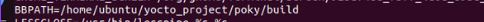

This file contains all the default configuration settings. Other configuration files and recipes commonly override some of the variable settings in this file according to their specific requirements.
The bitbake.conf file is part of the OpenEmbedded Core (OE-Core) metadata layer and can be found in the configuration file subdirectory conf of that layer.

### Layer Configuration (layer.conf)

The OpenEmbedded build system uses layers to organize metadata. A layer is essentially a hierarchy of directories and files. Every layer has its own configuration file named layer.conf . This file contains path settings and file patterns for the recipe files of the layer. The layer.conf file can be found
in the conf subdirectory of the layer.

### Build Environment Layer Configuration (bblayers.conf)

A build environment needs to tell BitBake what layers it requires for its build process. The file bblayers.conf provides BitBake with information on what layers to include with the build process and the filesystem paths where they are found.
Each build environment has its own bblayers.conf file, which can be found in the conf subdirectory of the build environment.
The file also sets BBPATH to the top-level directory of the build environment and initializes the recipe file list BBFILES with an empty string.
### Build Environment Configuration (local.conf)

Local configuration of a build environment is provided through a configuration file named local.conf . The local.conf file contains settings that apply to the particular build environment, such as paths to download locations, build outputs, and other files; configuration settings for the target system such as the target machine, package management system, and distribution policy; and many other settings. The local.conf file can be found in the conf subdirectory of the build environment.

### Distribution Configuration (<distribution-name>.conf)

Distribution configuration files contain variable settings reflecting policies that apply for a particular distribution built by the OpenEmbedded build system. For the Poky reference distribution, the default image name is also Poky, and its configuration settings are contained in a file named poky.conf .
Distribution policy settings typically include toolchain, C library, distribution name, and more. A distribution is selected by setting the variable DISTRO in the build environment’s local.conf file. Of course, you are not limited to the distribution policies provided by Poky as a reference. You can
create your own distribution policy file and use it with your build environment.
Distribution configuration files are typically found in the conf/distro subdirectory of a layer defining a distribution such as the meta-yocto layer.

### Machine Configuration (<machine-name>.conf)

One of the most powerful features of the OpenEmbedded workflow is its capability to strictly separate parts of the build process that are dependent on the particular hardware system, the machine, and its architecture from the parts that do not depend on it. This capability greatly simplifies the creation of board support packages (BSP), allowing them to provide only the necessary parts that are dependent on the hardware and thus complementing the machine-independent pieces of the build system. Consequently, building the same Linux distribution for another machine is as straightforward as
replacing one BSP with another. A major part of this architecture consists of the machine configuration files that contain variable settings for machine
dependencies referenced by the recipes that build software packages requiring machine-specific adaptions. Machine configuration files are named after the machine and can be found in the conf/machine subdirectory of a BSP layer.

### Recipes

BitBake recipes form the core of the build system as they define the build workflow for each software package. The recipes
contain the instructions for BitBake on how to build a particular software package . BitBake recipes are identified by their .bb file extension.
Recipes contain simple variable assignments as well as build instructions in the form of executable metadata, which are essentially functions that execute the process steps.
In contrast to configuration files, all variable assignments made within recipes are local to the recipe only. While recipes commonly reference variable settings made in configuration files and sometimes overwrite them for their purposes, all settings remain local to the recipe.
Many software packages are built in very similar ways using virtually identical build instructions following the same process steps. Repeatedly duplicating the same recipes while adjusting only a few parts that are specific to the software package would result in a lot of redundant effort. Hence, BitBake provides the concept of classes, a simple inheritance mechanism that allows recipes to easily share common workflows. Classes can be defined by any BitBake layer and are identified by their .bbclass file extension.

Another BitBake mechanism for recipes that fosters reuse is append files, which are identified by their .bbappend file extension. Append files are commonly used by layers building on top of other layers to tweak recipes contained in those layers for their special requirements. In most cases, they overwrite variable settings or modify them. Append files bear the same base filename as the core recipe from another layer that they are appending.

## Poky
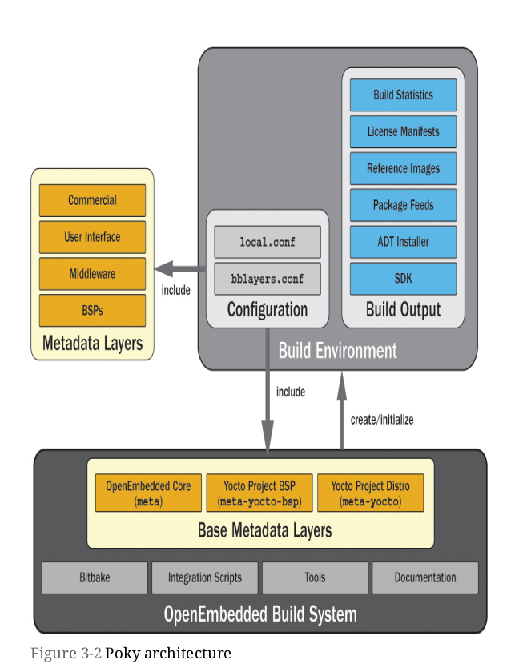

The Poky reference distribution also includes a minimum set of base metadata layers: Yocto Project BSP ( meta-yocto-bsp ) and Yocto Project
Distribution ( meta-yocto ).

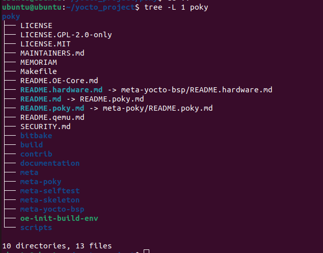

- the script oe-init-build-env creates and initializes the build environment. This script is one of the scripts contained within the build system. A
  build system and build environments form a 1:n relationship: a build system can be associated with any number of build environments, but a build environment can be associated with only one build system. This is an important limitation you need to be aware of when you are using more than one Yocto Project release at a time. You can use a build environment only with the version of the build system it was originally created with.
  Using a build system to initialize a build environment that is different from the one originally used to create the build environment leads to build failures.
to describe this point in more details:
1. The build system

In the Yocto Project, the build system is the overall set of tools, metadata, and scripts (like bitbake, oe-init-build-env, layers, recipes, etc.) that actually build your Linux image.

2. The build environment

The build environment is the output of running the oe-init-build-env script. It’s basically a directory structure (build/) with specific configuration files (conf/local.conf, conf/bblayers.conf, etc.), caches, work directories, and all the intermediate files generated during builds.

3. 1 : N Relationship

One build system → many build environments
You can use the same build system (e.g., a Yocto version like kirkstone) to create multiple separate build environments. For example:

build/ → For Raspberry Pi build

build-jetson/ → For NVIDIA Jetson build
Both can be initialized with the same version of the Yocto Project source tree.

One build environment → one build system
Once a build environment is created, it is tied to the version of the build system that created it. You can’t just take a build directory created by kirkstone and build it with dunfell or mickledore.

Why is this a limitation?
Because Yocto evolves:

The build system changes from release to release: different versions of BitBake, different layer metadata, new or changed classes, new variable names, and so on.

Your build environment stores build configuration, state, and caches that depend on these specifics.

Mixing these up causes conflicts — for example, tasks may fail, variables may be undefined, or incompatible layers might break your build.

- there is other script other than oe-init-build-env which is oe-init-build-env-memres , also creates
  and initializes build environments like oe-init-build-env but also launches a memory-resident BitBake server, which is listening on a TCP port for commands. This easily allows for running BitBake on remote build servers and controlling it from a local system over the network. The script’s command line is

$ oe-init-build-env <buildenv> <port>

Either the <port> argument or both arguments, <buildenv> and <port> , can be omitted, in which cases the defaults build and 12345 are used.

- A build system always has to include metadata layers, which provide recipes and configuration files. When you create a build environment with the oe-init-build-env script of the build system, the script automatically sets up a conf/bblayers.conf file that includes the three base layers: meta , meta-yocto-bsp , and meta-yocto .
These base layers are sufficient to build the standard Poky reference distribution. However, as an embedded Linux developer, you eventually want to create your own distribution, add your own software packages, and potentially provide your own BSP for your target hardware.
This goal is accomplished by including other metadata layers with the build system.

- Because OpenEmbedded keeps everything self-contained(It does not install things globally on your computer):

    You can easily use multiple Yocto versions on the same machine.

    Each version has its own isolated build environment.

    You can maintain your current product and develop the next one in parallel.

 - BitBake, the build engine, is an integral part of the OpenEmbedded build system. It evolves with the build system, and the Yocto Project developers  
   add new functionality to BitBake to support new features required by the build system.
   Consequently, BitBake is included with the build system, and you can find it in the bitbake subdirectory. Be aware that some Linux distributions include a BitBake package that you can install using the distributions package management system. If you have BitBake installed on your development host as part of the distribution, we recommend uninstalling it because it may interfere with the version contained in the build system. The build system and BitBake are matched to each other. Inadvertently using a BitBake version that does not match the build system may result on build failures.    

- The bitbake directory contains a doc subdirectory that contains the BitBake documentation and man pages. The documentation is written in DocBook format.

- The documentation directory contains the documentation for the Poky build system.

- The following are the various manuals you can also find on the Yocto Project’s website:

    Application Development Toolkit User’s Guide (adt-manual)

    BSP Developer’s Guide (bsp-guide)

    Development Manual (dev-manual)

    Linux Kernel Development Manual (kernel-dev)

    Profiling and Tracing Manual (profile-manual)

    Reference Manual (ref-manual)

    Yocto Project Quick Start (yocto-project-qs)

    Toaster Manual (toaster-manual)

- The LICENSE file contains the licensing information for the Poky build system.    
- It is important to note that there can be, and commonly is, a difference in licensing of the source code of a package and the metadata (recipe) that  
  builds that package. Be sure not to confuse the two because it can have implications for the product you are developing.

- The directories starting with meta are all metadata layers:

    meta: OE Core metadata layer

    meta-hob: Metadata layer used by the Hob graphical user interface for BitBake

    meta-selftest: Layer for testing BitBake that is used by the oe-selftest script

    meta-skeleton: Template layer you can use to create your own layers

    meta-yocto: Yocto Project distribution layer
    
    meta-yocto-bsp: Yocto Project BSP layer  

### support scripts for working with Yocto Project builds

bitbake-whatchanged: Lists all components that need to be

rebuilt as a consequence of changes made to metadata between two builds

cleanup-workdir: Removes build directories of obsolete packages from a build environment

create-recipe: Creates a recipe that works with BitBake

hob: Launches Hob, the graphical user interface for BitBake

runqemu: Launches the QEMU emulator

yocto-bsp: Creates a Yocto Project BSP layer

yocto-kernel: Configures Yocto Project kernel recipes inside a Yocto Project BSP layer

yocto-layer: Creates a metadata layer that works with BitBake

## Other directories and files are created during the build process.
All build output is placed into the tmp subdirectory. You can configure this directory by setting the TMPDIR variable in the conf/local.conf file of the environment. Build output inside the tmp directory is organized into a variety of subdirectories:

buildstats: This subdirectory stores build statistics organized by build target and date/time stamp when the target was built.

cache: When BitBake initially parses metadata, it resolves dependencies and expressions. The results of the parsing process are written into a cache. As long as the metadata has not changed, BitBake retrieves metadata information from this cache on subsequent runs.

deploy: The build output for deployment, such as target filesystem images, package feeds, and licensing information, is contained in the deploy subdirectory.

log: Here is where you can find the BitBake logging information created by the cooker process.

sstate-control: This subdirectory contains the manifest files for the shared state cache organized by architecture/target and task.

stamps: BitBake places completion tags and signature data for every task organized by architecture/target and package name into this subdirectory.

sysroots: This subdirectory contains root filesystems organized by architecture/target. Contents includes a root filesystem for the build host containing cross-tool-chain, QEMU, and many tools used during the build process.

work: Inside this directory, BitBake creates subdirectories organized by architecture/target where it builds the actual software packages.

work-shared: This subdirectory is similar to work but is for shared software packages.

- While build environments, and in particular the tmp directory typically located within them, cannot be easily relocated, BitBake can essentially re-create all contents of the tmp directory from the shared state cache. The shared state cache stores the intermediate output of the tasks identified by a signature that is created from its input metadata, such as task code, variables, and more. As long as the input does not change, the signature does not change, causing BitBake to use the output from the shared state cache rather than running the task. That shortens build time considerably, particularly for tasks that can take a long time to run, such as configuring or compiling.

## Metadata Layer Structure

Metadata layers are containers to group and organize recipes, classes, configuration files, and other metadata into logical entities. Layers commonly build on and extend each other. The OE Core layer forms a foundation for the layer architecture of the Poky build system. It provides recipes for a core set of software packages that are needed by most Linux OS stacks, including, of course, the Linux kernel but also bootloaders, graphics, networking, and many other packages. OE Core also provides the base classes to build software packages, package the software with package management systems, create
filesystem images, and extend the BitBake functionality.

The OE Core layer by itself, complemented by BitBake and the convenience and integration scripts, is sufficient for building a Linux OS stack for an emulated device. OE Core includes basic image targets as well as machine definitions for the QEMU emulator for ARM, MIPS, PowerPC, x86, and x86_64
architectures.

A build environment for a device operating system stack would typically include other layers, such as a BSP layer for actual hardware; a distribution layer specifying the OS configuration for user accounts, system startup, and more; and a user interface layer and application layers for the user space
applications providing the device functionality. 

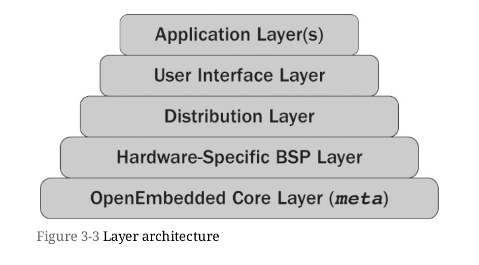

## Layer Layout
All layers, no matter what purpose they serve, have the same basic structure.

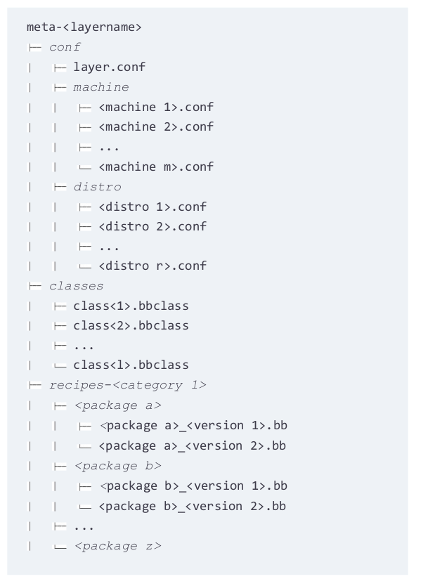

A metadata layer is essentially a structure comprising directories and files. The name of the top-level directory of the layer does not strictly matter; however, by convention, all layer directory names start with the term meta followed by a hyphen and the name of the layer.
Every layer must include a conf subdirectory that must contain the layer configuration file layer.conf . BitBake requires this file to set up paths and search patterns for metadata files. 

**layer.conf**

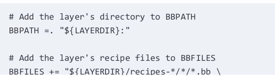
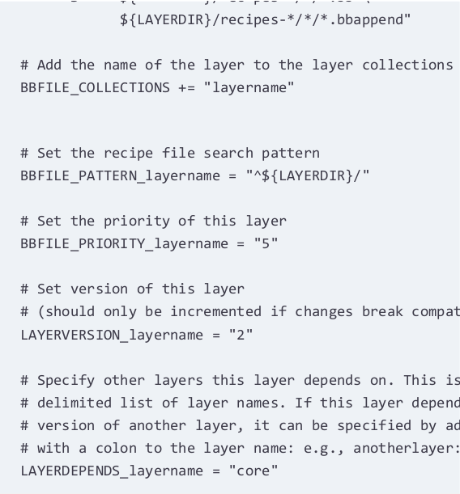

The first assignment adds the layer’s directory to the BBPATH variable. The variable LAYERDIR is expanded by BitBake to the canonical path name of the layer. Then the layer’s recipes are added to the BBFILES variable. You can see that the wildcard expressions match the layout of the recipes’ directories in the layer. Wildcards for both recipes and recipe append files need to be added to BBFILES .
BBFILE_COLLECTIONS is a list of layer names delimited by spaces. Each layer adds its name to the list. BBFILE_PATTERN contains a regular expression to match the recipes of this layer within the BBFILES variable. This variable is conditional on the layer, and hence the variable name needs to be suffixed with the name of the layer.

Since layers depend on and extend each other, the order of processing is important. Therefore, each layer is assigned a priority by setting the variable BBFILE_PRIORITY . Layer priorities range from 1 to 10 with 1 being the lowest and 10 being the highest priority. If two layers use the same priority,
then their order in the BBLAYERS variable of the file bblayers.conf file determines the priority.

Optionally, a layer can also define a version number by setting the variable LAYERVERSION . The layer version can be used together with the LAYERDEPENDS variable to prevent including incompatible versions of a layer. If a layer depends on other layers, these dependencies can be set by adding the layers to the LAYERDEPENDS variable, which contains a list of space-delimited layer names. If the dependency is on a particular version of the layer, the version number can be specified by adding a colon and the version number.

The conf subdirectory may contain other files and directories, in particular, the distro and machine subdirectories. These are optional. Typically, only a distribution layer would contain a distro subdirectory, and only BSP layers normally contain the machine subdirectory. If present, each of these two
subdirectories contain files for distribution and machine configuration.

If a layer defines its own classes, they are located in the classes subdirectory.
The layer’s recipes are grouped by category and package. A category is a collection of packages that logically belong together. For example, the category recipes-connectivity of the OE Core metadata layer contains recipes that build packages for networking, telephony, and other connectivity software.

Within each category subdirectory, there are subdirectories for the different software packages. These package subdirectories contain recipes, patches, and other files required to build the software package. Commonly, a package subdirectory contains recipes to build different versions of the particular package.

## Creating Layers

Even if you have only one or two recipes to begin with, it is good practice to place your recipes into your own layer rather than add them to the OE Core layer or any of the Yocto Project layers.

Your own layers separate your recipes from the common recipes, making it easy for you to migrate from one version of the OpenEmbedded build system to the next. You only need to create a new build environment with the newer build system and include your layers into this build environment.

By using bbappend files in your layers, you can adjust recipes from common layers rather than duplicate or rewrite them.
Consider the recipes in meta/recipes-kernel/linux for building the Linux kernel. For the most part, they already provide everything necessary for building the kernel. For your own BSP layer, you normally need to tweak only a couple of settings to fully support your target hardware. Rather than
duplicating the kernel recipe, you can use bbappend files or include files to customize the base recipe to your requirements.

Creating layers is simple and straightforward with the yocto-layer script. After sourcing a build environment, this script is readily available in your command search path. Simply invoke the script as

## BitBake Build Engine

when for example

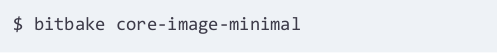

core-image-minimal corresponds to the recipe core-image-minimal.bb . However, unlike Make and Ant, BitBake does not automatically look for the recipe in the current directory. BitBake requires that you set up an execution environment before it can locate and execute build instructions.
Bitbake when launched, it first searches for the conf/bblayers.conf configuration file in the current working directory.

**conf/bblayers.conf**

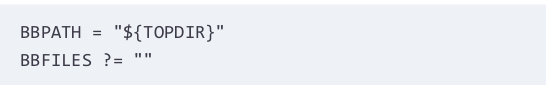
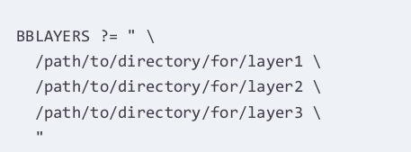

BitBake expects this file to contain a variable called BBLAYERS , which contains a list of paths to directories where the layers included in the build environment can be found. Each of these layer directories is expected to contain a file named conf/layer.conf

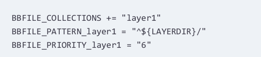

The purpose of the layer configuration file conf/layer.conf is to set up the variables BBPATH and BBFILES correctly so that BitBake can find the recipes, classes, and configuration files contained in the layer:
BBPATH: BitBake uses this variable to locate classes ( .bbclass files) in a subdirectory named classes and configuration files ( .conf files) in a subdirectory called conf and subdirectories thereof. The variable contains a list of colon-delimited directory paths.

BBFILES: This variable contains a list of paths with wildcards, for the recipe files.

A layer typically adds the path to its own top-level directory to the list of paths contained in BBPATH . BitBake automatically sets the variable LAYERDIR to the path to the top-level directory of a layer when it begins parsing the files in that layer.

The layer also adds the paths to the recipe files it provides to a list of file paths contained in the BBFILES variable. The file paths represent the directory structure that contains the recipes of the layer.

The three variables BBFILE_COLLECTIONS , BBFILE_PATTERN , and BBFILE_PRIORITY provide BitBake with information on how to locate and treat the recipes of this layer in regard to other layers:
BBFILE_COLLECTIONS: Contains a list of the names of configured layers. This list is used by BitBake to find other BBFILE_* variables in its data directory. Each layer typically adds its own name to the list.
BBFILE_PATTERN: A regular expression telling BitBake how to locate recipe files from this layer within BBFILES . The value that a layer sets this variable to corresponds to the paths it adds to the BBFILES variable. Since all paths in BBFILES typically begin with the top-level directory of the layer, the regular expression reflects that convention. The name of the variable must be appended with an underscore and the name of the
layer.

BBFILE_PRIORITY: Assigns a priority to the recipes contained in this layer.

After parsing conf/bblayers.conf , BitBake looks for the configuration file conf/bitbake.conf , which provides the build system setup. If layers are not used and therefore no conf/bblayers.conf file is present, then the BBPATH variable needs to be set up as shown previously, and the file conf/bitbake.conf must contain variable assignments for BBFILES .
After locating and parsing conf/bitbake.conf and other configuration files, BitBake locates and parses all classes. At least one class, base contained in the file base.bbclass , must be present for BitBake to operate correctly. This class provides the basic functions and tasks, including the default build task.

## BitBake Metadata

BitBake uses metadata to control the build process. In general, metadata describes the software packages, how they are built, and how they relate to and depend on each other. BitBake distinguishes two types of metadata:

Variables: Variables are assigned values and expressions that evaluate to values. Variables can be globally valid for the entire build system or locally valid for the current context, such as for a particular recipe. Many BitBake metadata variables contain not only a single value but a space-delimited list of values.

Executable Metadata: Executable metadata are functions and tasks embedded in recipes and classes that are executed by BitBake within the context of a recipe.

Metadata is organized in five categories of files:

Configuration Files (.conf): Metadata placed in

configuration files is global and affects all recipes referencing them. 
Configuration files may contain only variables with no executable metadata. If the same variable is assigned in multiple configuration files, then the order established by the layer priority determines which setting prevails. The configuration file bitbake.conf has the lowest priority, and the local configuration file of the build environment local.conf has the highest.

Recipe Files (.bb): Recipes contain the metadata that describes a particular software package and how that software package is built. A recipe typically provides executable metadata in the form of tasks with instructions for downloading, unpacking, patching, compiling, packaging, and installing the software package.

Class Files (.bbclass): Class files provide a simple inheritance mechanism for recipes to share the same build instructions. BitBake searches for class files inside of the classes subdirectory of a layer. Recipes can include class files by simply referencing them by their name using the inherit
directive. Classes are global, meaning that recipes located in a layer can inherit classes from any other layer the build environment includes.

Append Files (.bbappend): Append files are extensions to recipe files. Typically, a layer uses append files to extend arecipe contained in another layer. The append file must have the same base name as the recipe it extends but with the .bbappend extension instead of the .bb extension. An append
file must also have the same path relative to the layer’s root directory as the recipe it is appending. Append files either add additional metadata or modify metadata defined in the recipe. The content of an append file is literally appended to the original recipe. If append files from different layers append the same recipe, the layer priority determines in which order BitBake appends the files to the recipe.

Include Files (.inc): Any metadata file can include other files using the include and require directives. Include files commonly provide metadata that is shared among multiple metadata files. The content of the include file is inserted into the including metadata file at the position of the respective
directive. Include files themselves may also include other files.

This of course bears the risk of circular inclusion, which BitBake detects and warns about. File inclusion is not limited to the same layer, but a recipe in one layer can include a file from another. The .inc file extension is purely conventional. A metadata file can include any other metadata file; however, files containing executable metadata may be included only by recipes, append files, and classes.

BitBake parses the metadata files immediately after starting and creates a metadata cache. This cache is essentially a persistent form of BitBake’s metadata dictionary. As long as there are no changes to the metadata, BitBake reads it from the cache, significantly reducing start time.

## Inclusion

Metadata files can include other metadata files to allow for shared settings.
BitBake offers two inclusion directives for optional and required inclusion:

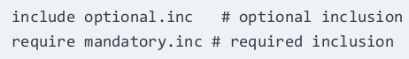

When using option inclusion with the include directive, BitBake attempts to locate the include file but silently continue operation even if it cannot find the file. Conversely, required inclusion with the required directive causes BitBake to exit with an error message.

The include and required directives can be used with
relative and absolute paths:

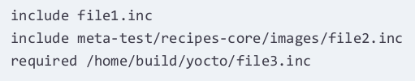

When relative paths are used, BitBake tries to locate the file using the list of file paths specified by the BBPATH variable. BitBake uses the first file it finds that has the correct path segment and filename. After BitBake locates the include file, it parses its contents and inserts the contents into the including file at the very position it encountered the inclusion directive. Hence, include files can override settings previously made by the including file, and vice versa, making it important that the inclusion directives are placed at the proper position in the including file.

Recipes and classes can include files that contain configuration settings as well as executable metadata. Configuration files, however, can only include files
that contain configuration settings but no executable metadata, since the latter is not supported in configuration files.

## Inheritance

Through classes, BitBake provides a simple inheritance
mechanism. Classes can be inherited by recipes, append files,
and other classes using the inherit directive:

Classes are metadata files with the filename extension .bbclass that are placed inside the classes subdirectory of metadata layers. The inherit directive only uses the class name, which is the base name of class filename without the extension. It can be used only in recipes, append files, and other class files.

At first glance, inheritance seems to be very similar and eventually redundant to inclusion. The difference, however, lays in how BitBake processes and parses classes:

- BitBake identifies classes by their class name and not by their filename and path, which means class names must be unique across all metadata layers  
  included by a build environment.

- BitBake parses classes once after it has completed parsing the configuration files and before it parses the recipes. Include files are parsed when BitBake encounters an inclusion directive. If the same include file is included by multiple other files, BitBake parses the same file multiple times within the context of the including file. That makes classes a more efficient mechanism for build instructions that are shared by many different recipes.
However, using include files for recipes building different versions of the same software package is a good choice. since typically only one version at a time of a particular software package is built.

The use of common classes simplifies many recipes. For example, the autotools class for building software packages utilizing the GNU Autotools configuration mechanisms can reduce a recipe to a few lines of code

**Using the autotools Class**

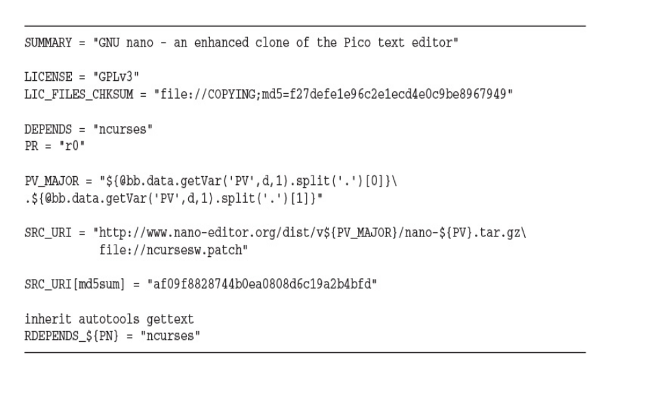

The preceding recipe builds the GNU nano editor, which is an autotooled software package. The recipe itself only specifies SRC_URI and package name, while all the complexities of building autotooled software packages are hidden within the autotools class.

## Executable Metadata

Recipes, append files, and classes can include definitions of executable metadata. Executable metadata are shell or Python functions that BitBake can execute. bitBake treats executable metadata exactly the same as variables: the function name is stored in the data dictionary together with the function code that represents the assigned value. Consequently, functions can be appended and prepended like regular variables and may also have metadata attributes.
The scope of metadata functions defined in recipes and append files is local to the particular file, whereas functions defined in classes are global.

### Shell Functions

Executable metadata can be defined as shell functions

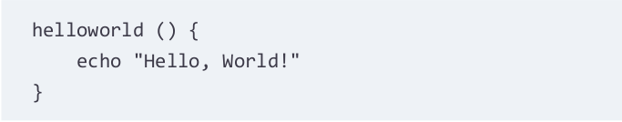

The code inside the function’s body follows regular shell syntax. In fact, BitBake calls the shell interpreter /bin/sh when executing shell functions.

### Python Functions

Executable metadata can also be defined as Python functions

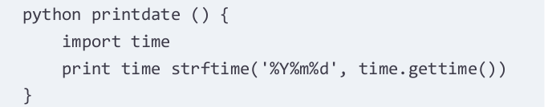

### Global Python Functions 

Functions can be defined globally using the def keyword regardless of the file they are defined in

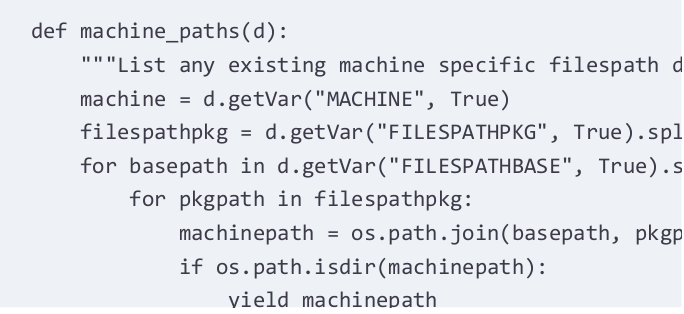

Since the function is global, it can be called from any other Python metadata function.

### Anonymous Python Functions

Recipes, append files, and classes may define anonymous Python functions using the __anonymous keyword as the function’s name or by omitting the function name altogether

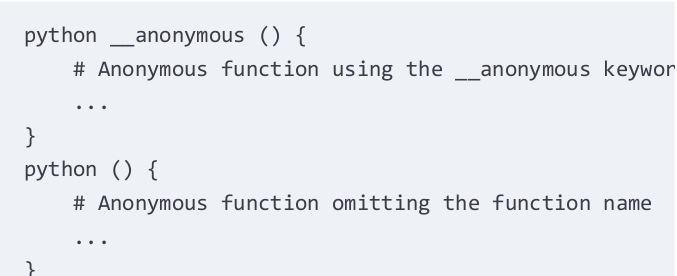

BitBake executes anonymous functions at the end of the parsing process of a particular unit. For example, an anonymous function defined inside a recipe is executed after the recipe has been parsed.

## Tasks

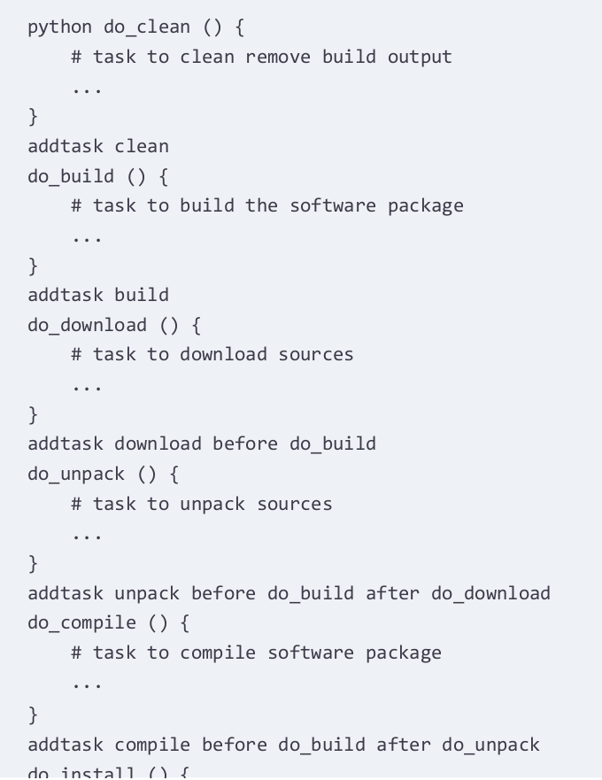
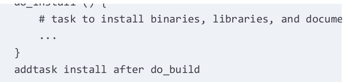

This code defines the task clean and adds it to the task list with addtask . This technique allows for the task to be invoked from the BitBake command line.
BitBake recognizes special functions called tasks. Tasks are defined in recipes and classes and can be Directly invoked from the BitBake command line for a particular recipe. Automatically executed by BitBake as part of the build process.

To define a shell or Python function as a task, its name must be prefixed with do_ . Other than that, a task is exactly like any other executable metadata. The directive addtask is used to add a task to the BitBake task list and to define a task execution chain.

Running 

runs first the download task, then the unpack task, then the compile task, then the build task, and finally the install task.

When BitBake is invoked with the recipe as parameter but without specifying a task to be run, then it runs the default task.
The default task is defined by the variable BB_DEFAULT_TASK . This variable is set by the base class to

making build the default task similar to the all target for makefiles. Recipes and classes can of course override BB_DEFAULT_TASK setting it to a different task.

## source download

### Local File Fetcher

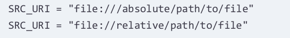

**BitBake uses a defined sequence to access locations and sites for files:**

1. BitBake first checks the local download directory specified by DL_DIR that the files provided in SRC_URI have already been downloaded. If that is the case, it skips accessing any upstream and mirror sites and uses the files in DL_DIR . If some of the files are present and others are not, BitBake incrementally downloads the files. If SRC_URI is an SCM repository, it verifies the correct branches and tag in DL_DIR and eventually updates
them as required.

2. If files provided in SRC_URI are not available locally, BitBake attempts to download them from mirror sites specified by the PREMIRRORS variable.

3. If the premirror sites do not provide the package, BitBake uses SRC_URI to download the files directly from the upstream project site.

4. If downloading from the upstream project site is unsuccessful, BitBake uses the mirror sites provided by the MIRRORS variable.

5. If none of the download sites provide the required files, BitBake posts an error message.Using mirrors and the preceding sequence is BitBake’s default
behavior. If you do not want to use mirrors, you need to set either the PREMIRRORS or MIRRORS variables or both to an empty string.

The PREMIRRORS and MIRRORS variables specify lists of tuples consisting of a regular expression for the key to match the SRC_URI and URI pointing to the respective mirror:

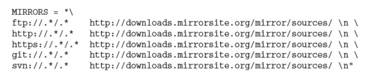

## Creating Mirrors

Creating your own mirror site has advantages, such as minimizing network access for teams and controlling the sources from which your product’s Linux distribution is built. You can create your own mirror site by downloading all source packages from the Yocto Project mirror and placing them into a
directory of an intranet server. You can also create a mirror from the download directory of a Yocto Project build environment you have been using for building a Linux distribution for your project. Your local download directory already contains all the necessary sources, but not yet in a
format that is suitable for a mirror site. By default, and to save build time, BitBake does not create source tarballs for SCM repositories. You can instruct BitBake to create the tarballs in your local download directory by adding

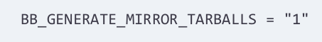

to your conf/local.conf file. After your build has finished successfully, simply copy all the files in your download directory to your mirror server. You have to copy the files. You cannot use symbolic links to the files because the fetchers do not follow symbolic links.