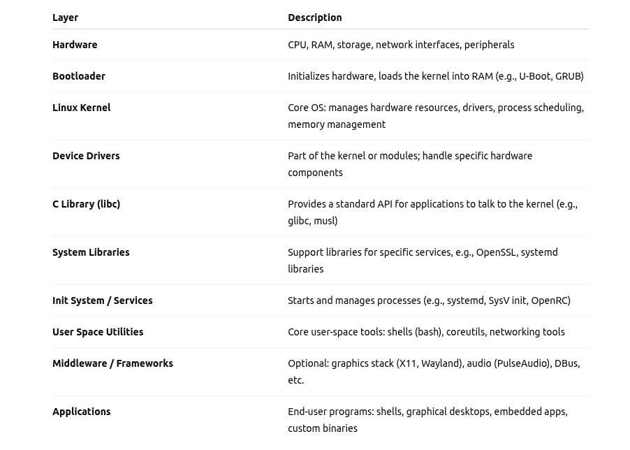
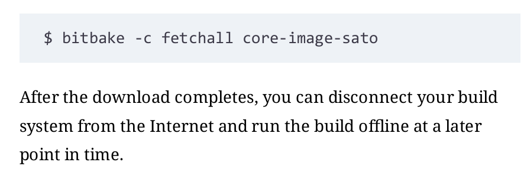
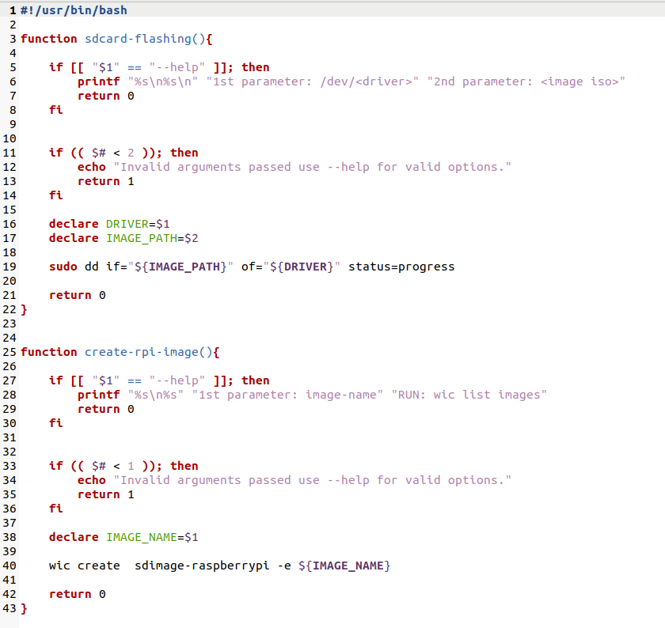
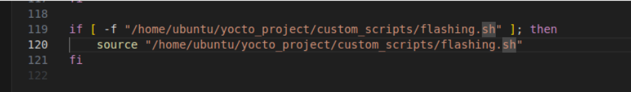

## Why Linux for Embedded Systems?
There are many reasons for the rapid growth of embedded
Linux. 
To name a few:
- Royalties: Unlike traditional proprietary operating systems, Linux can be deployed without any royalties.
- Hardware Support: Linux supports a vast variety of hardware devices including all major and commonly used CPU architectures: ARM, Intel x86, MIPS, and PowerPC in their respective 32-bit and 64-bit variants.
- Networking: Linux supports a large variety of networking protocols. Besides the ubiquitous TCP/IP, virtually any other protocol on any physical medium is implemented.
- Modularity: A Linux OS stack is composed of many different software packages. Engineers can customize the stack to make it exactly fit their application.
- Scalability: Linux scales from systems with only one CPU and limited resources to systems featuring multiple CPUs with many cores, large memory footprints, several networking interfaces, and much more.
- Source Code: The source code for the Linux kernel, as well as for all software packages comprising a Linux OS stack, is openly available.
- Developer Support: Because of its openness, Linux has attracted a huge number of active developers, and those developers have quickly built support for new hardware.
- Commercial Support: An increasing number of hardware and software vendors, including all semiconductor manufacturers as well as many independent software vendors (ISV), are now offering support for Linux through products and services.
- Tooling: Linux provides myriad tools for software development ranging from compilers for virtually any programming language to a steadily growing number of profiling and performance measurement tools important for embedded systems development.

and the important thing is that in our graduation project we didn't need to develop the device drivers for UART ,camera and many others and this decreased our development time

## Embedded Versions of Full Linux Distributions
- Debian (www.emdebian.org)
- Fedora (https://fedoraproject.org/wiki/Embedded)Gentoo (https://wiki.gentoo.org/wiki/Project:Embedded)
- SUSE (https://tr.opensuse.org/MicroSUSE)
- Ubuntu (https://wiki.ubuntu.com/EmbeddedUbuntu)

  **and we are working on Ubuntu**

## Embedded Linux Development Tools
- Baserock

    Baserock is an open source project that provides a build system for Linux distributions, a development environment, and a development workflow in one package.
    The project’s homepage is at http://wiki.baserock.org.

- Buildroot

    Buildroot is a build system for complete embedded Linux systems using GNU Make and a set of makefiles to create a cross-compilation toolchain, a root filesystem, a kernel image, and a bootloader image. The project’s homepage is at  http://buildroot.uclibc.org.
    Buildroot mainly targets small footprint embedded systems and supports various CPU architectures. To jump start development it limits the choice of configuration options and defaults to probably the most commonly used ones for embedded system.

- OpenEmbedded

    OpenEmbedded (www.openembedded.org) is a build framework composed of tools, configuration data, and recipes to create Linux distributions targeted for embedded devices. At the core of OpenEmbedded is the BitBake task executor that manages the build process.

- The Yocto Project

    **Yocto Project is our subject**. It is listed here to complete this overview of the embedded Linux landscape. 
    You can find its webpage at https://www.yoctoproject.org.

## we have to approaches for building our embedded project:
- top-down :

    In this approach, you start with one of the many
    available Linux distributions and customize it according to your requirements by adding and/or removing software packages.
    The author took this approach many years ago with a high-speed image processing system running on x86 server hardware. It is a viable approach and has its appeal because using a tested and maintained distribution alleviates some of the more tedious tasks of building and maintaining your own distribution. And you may be able to get support for it.
    However, it may limit you in your choice of hardware, since most off-the-shelf Linux distributions are built for x86 hardware. And, of course, picking the right distribution to start off with and rightsizing it for your target device is not that simple either.

- Bottom-up: 

    The bottom-up approach entails building your own custom Linux distribution from source code starting with a bootloader and the kernel and then adding software packages to support the applications for your target device. This approach gives you the most control, but it is also a challenging task. You will have to make many choices along the way, from selecting the right toolchain and setting kernel configuration options to choosing the right software packages. Some of these choices are interdependent, such as the choice of toolchain and target library, and taking the wrong turn can quickly send you
    down a dead end. After you have successfully built and deployed your own distribution, you are left with the burden of maintaining it—finding patches and security updates for the kernel and all the other packages you have integrated with your distribution.

    **This is where the strengths of the Yocto Project lie**. It combines the best of both worlds by providing you with a complete tool set and blueprints to create your own Linux distribution from scratch starting with source code downloads from the upstream projects. 
    The blueprints for various systems that ship with the Yocto Project tools let you build complete operating system stacks within a few hours. 
    You can choose from blueprints that build a target system image for a basic system with command-line login, a system with a graphical user interface for a mobile device, a system that is Linux Standard Base compliant, and many more.

    You can use these blueprints as a starting point for your own distribution and modify them by adding and/or removing software packages.

## Yocto Project
- The Yocto Project (YP) is an open source collaboration project containing a comprehensive suite of tools, templates, and resources that helps   
  developers create custom Linux-based systems regardless of the hardware architecture.

**It’s not an embedded Linux distribution, it creates a custom one for you.**

### Prerequisites

- how to prepare your computer to become a YoctoProject development host.

### Hardware Requirements
Despite their capability to build Linux OS stacks, the Yocto Project tools require a build host with an x86 architecture CPU.
Both 32-bit and 64-bit CPUs are supported. A system with a 64-bit CPU is preferred for throughput reasons. The Yocto Project’s build system makes use of parallel processing whenever possible. Therefore, a build host with multiple CPUs or a multicore CPU significantly reduces build time. Of course, CPU clock speed also has an impact on how quickly packages can be built.Memory is also an important factor. BitBake, the Yocto Project build engine, parses thousands of recipes and creates a cache with build dependencies. Furthermore, the compilers require memory for data structures and more. 
**The tools do not run on a system with less than 1 GB of RAM; 4 GB or more is recommended.**

Disk space is another consideration. A full build process, which creates an image with a graphical user interface (GUI) based on X11 currently consumes about 50 GB of disk space. If, in the future, you would like to build for more architectures and/or add more packages to your builds, you will require additional space.**It is recommended that the hard disk of your system has at least 100 GB of free space**. Since regular hard disks with large
capacity have become quite affordable,**we recommend that you get one with 500 GB or more to host all your Yocto Project build environments.**

Since build systems read a lot of data from the disk and write large amounts of build output data to it, disks with higher I/O throughput rates can also significantly accelerate the build process.
Using a solid-state disk can further improve your build experience, but these devices, in particular with larger capacity, are substantially higher in cost than regular disks with spinning platters. Whether you are using conventional hard drives orsolid-state disks, additional performance gains can be realized with a redundant array of independent disks (RAID) setup, such as RAID 0.

- **Internet Connection**

The OpenEmbedded build system that you obtain from the project’s website contains only the build system itself—BitBake and the metadata that guide it. It does not contain any source packages for the software it is going to build. These are automatically downloaded as needed while a build is running.
Therefore, you need a live connection to the Internet, preferably a high-speed connection.
Of course, the downloaded source packages are stored on your system and reused for future builds. You are also able to download all source packages upfront and build them later offline without a connection to the Internet.

### software requirement
1- you will need a recent Linux distribution:
- CentOS
- Fedora
- openSUSE
- **Ubuntu**

In general, both the 32-bit and the 64-bit variants have been verified; however, it is recommended that you use the 64-bit version if your hardware supports it.

2- install yocto project bitbake extension on vs code.

3-prepare the environment host machine by installing these additional software packages 

    sudo apt install gawk wget git diffstat unzip texinfo gcc build-essential chrpath socat cpio python3 python3-pip python3-pexpect xz-utils debianutils iputils-ping python3-git python3-jinja2 libegl1-mesa libsdl1.2-dev python3-subunit mesa-common-dev zstd liblz4-tool file locales libacl1
    sudo locale-gen en_US.UTF-8

4- Choose YOCTO release [- - wiki.yoctoproject.org/wiki/Releases](https://wiki.yoctoproject.org/wiki/Releases) 
    - [github.com/yoctoproject/poky](https://github.com/yoctoproject/poky) 

##### clone poky.

    git clone -b kirkstone https://github.com/yoctoproject/poky.git

##### switch directory.

    cd poky

5- Configuring the Build Environment

Poky provides the script oe-init-build-env to create a new build environment. The script sets up the build environment’s directory structure and initializes the core set of configuration files. It also sets a series of shell variables needed by the build system. You do not directly execute the oe-init-build-env script but use the source command to export the shell variable settings to the current shell

##### - source <script>
    source oe-init-build-env

Inside the newly created build environment, the script added the directory conf and placed the two configuration files in it:
bblayers.conf and local.conf .

##### - after sourcing ---> build directory.
    cd conf
    vi local.conf

In local.conf , various variables are set that influence how BitBake builds your custom Linux OS stack.
###### Linux OS stack

##### - change Machine Variable.
    MACHINE ??="qemuarm64"

##### - Add Number of threads:

    BB_NUMBER_THREADS="8"
    PARALLEL_MAKE="-j 8"

The default value for the two parallelism options BB_NUMBER_THREADS and PARALLEL_MAKE is automatically computed on the basis of the number of CPU cores in the system using all the available cores. You can set the values to less than the cores in your system to limit the load. Using a larger number
than the number of physical cores is possible but does not speed up the build process. BitBake and Make spawn more threads accordingly, but they run only if there are CPU cores available.
Never forget the quotes around the variable settings. Also note that for PARALLEL_MAKE , you have to include the -j , such as "-j 4" because this value is passed to the make command verbatim.

##### - build image.
    bitbake core-image-minimal # image name (* meta-data *).

 - You may also instruct BitBake to first download all the sources without building. You can do this with

 - you can instruct BitBake to continue building even if it encounters an error condition as long as there are tasks left that are not impeded by the error:
 
 The -k option tells BitBake to continue building until tasks that are not dependent on the error condition are addressed.
##### - after build
    runqemu <MACHINE> # runqemu qemuarm64 nographic

6- and finally add the path of this file to ~./bashrc

page 94